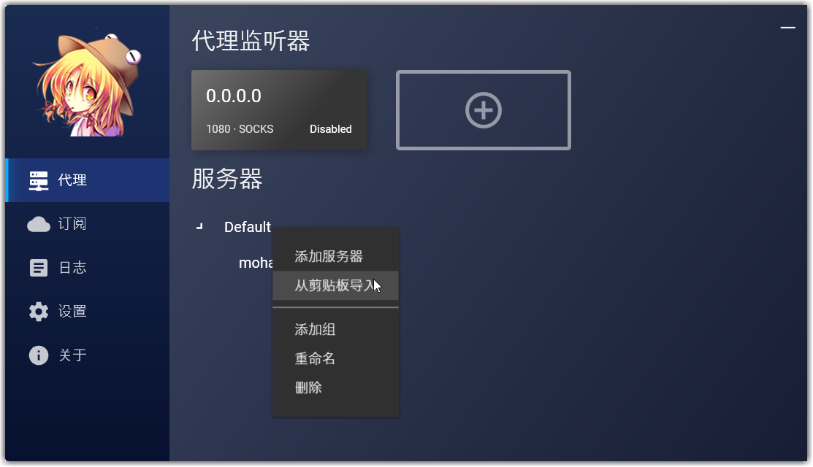

怎样在Ubuntu 20.04上安装NaiveProxy？

how to install NaiveProxy on Ubuntu 20.04

{}

## 前提:)

* 仅`windows` 10 Pro教程
* 域名
* Ubuntu 20.04
* ProxySU
* NaiveGUI
* [工具打包下载](https://huhu.blue/tools/)


## 服务器端:)

1. 一台`Ubuntu` 20.04 服务器,已经知道root密码:)


2. proxysu一秒安装


3. 服务器端安装成功


## windows客户端:)

1. 剪贴板导入链接



2. start


3. too young too simple sometimes naive!?


不过还是推荐使用`mellow`
```bash
choco install -y mellow
```

推荐个几把，mellow调试失败




## 前提

* Ubuntu 20.04
* mobaxterm
* 域名

## 服务器端

安装libnss3

```bash
apt install libnss3
```

安装`caddy 1.0`带`http.forwardproxy`版本

```bash
curl https://getcaddy.com | bash -s personal http.forwardproxy
```

`caddy`开机自启

```bash
cat <<EOF > /etc/systemd/system/caddy.service
[Unit]
Description=Caddy
Documentation=https://caddyserver.com/docs/
After=network.target

[Service]
User=root
Group=root
ExecStart=/usr/local/bin/caddy  --conf /etc/caddy/Caddyfile
ExecReload=/usr/local/bin/caddy reload --conf /etc/caddy/Caddyfile


[Install]
WantedBy=multi-user.target
EOF
```

caddy配置

```bash
mkdir -p /etc/caddy 

cat <<EOF > /etc/caddy/Caddyfile
moha.scaleya.xyz
root /var/www/html
tls scaleya.com@gmail.com
forwardproxy {
  basicauth admin admin
  hide_ip
  hide_via
  probe_resistance secret.localhost
  upstream http://127.0.0.1:8080
}
EOF
```

```cwl
systemctl daemon-reload
systemctl enable caddy
systemctl stop caddy
systemctl start caddy
systemctl status caddy
```

自己编译NaiveProxy

```
apt install git python2 ninja-build pkg-config  libnss3-dev  curl unzip ccache
cd /srv 
git clone https://github.com/klzgrad/naiveproxy.git
cd /srv/naiveproxy/src
./get-clang.sh
./build.sh


../../build/build_config.h:45:10: fatal error: 'unistd.h' file not found
#include <unistd.h>
         ^~~~~~~~~~
1 error generated.
[10/1891] ACTION //base:partition_alloc_buildflags(//build/toolchain/linux:clang_x64)
ninja: build stopped: subcommand failed.

算了 没搞出来
```

下载二进制包

```bash
mkdir -p /etc/NaiveProxy

wget https://github.com/klzgrad/naiveproxy/releases/download/v83.0.4103.61-1/naiveproxy-v83.0.4103.61-1-linux-x64.tar.xz

tar -xf naiveproxy*.tar.xz && rm naiveproxy*.tar.xz

cp naiveproxy*/* .
```

```bash
cat <<EOF > /etc/systemd/system/naive.service
[Unit]
Description=NaiveProxy
Documentation=https://github.com/klzgrad/naiveproxy
After=network.target

[Service]
User=root
Group=root
ExecStart=/etc/NaiveProxy/naive  /etc/NaiveProxy/config.json
TimeoutStopSec=5s
LimitNOFILE=1048576
LimitNPROC=512
PrivateTmp=true
ProtectSystem=full
AmbientCapabilities=CAP_NET_BIND_SERVICE

[Install]
WantedBy=multi-user.target
EOF
```

```bash
cat <<EOF > /etc/NaiveProxy/config.json
{
  "listen": "http://127.0.0.1:8080",
  "padding": true
}
EOF
```

```bash
systemctl daemon-reload
systemctl enable naive
systemctl stop naive
systemctl start naive
systemctl status naive
```

 